# MUBI - Digital Wallet Sign Up

Welcome! This repository contains the code to create a fully validated and user-friendly registration process for a digital wallet application. Feel free to test it. Your information will not be stored once the process is complete.
When the sign-up flow is finished, a mocked token will allow you to stay logged in for a few minutes.

**Link to the deploy:**  https://mubi-digital-wallet-sign-up-anhubacek.vercel.app/

---

## 🚀 Project Overview

- **Brand**: Create a brand (MUBI) and logo so I could base the application colors on it
- **User Experience**: Modern and friendly design with visual effects.
- **Form Validation**: Ensuring data integrity and user input accuracy.
- **Responsive Design**: Optimized for both desktop and mobile devices.

---

## 🛠️ Technologies 

- React + Vite
- TypeScript
- Tailwind CSS
- Framer Motion

- React International Phone
- Geonames
- MUI Date Pickers

---

## 📸 Screenshots
<div style="display: flex; flex-wrap: wrap;">
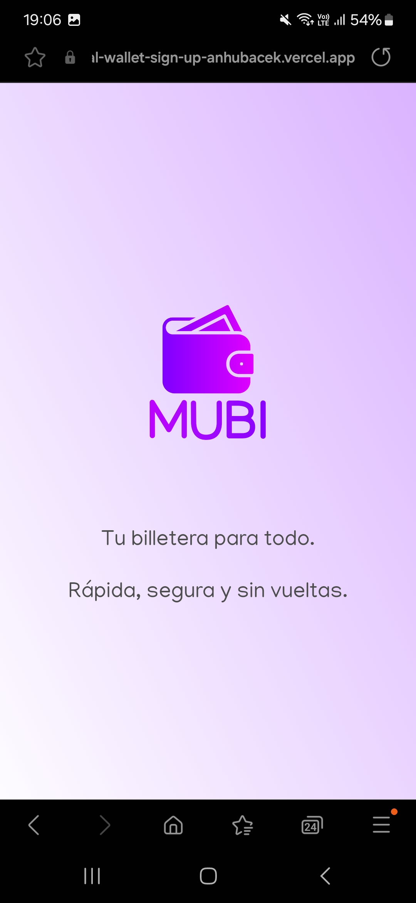
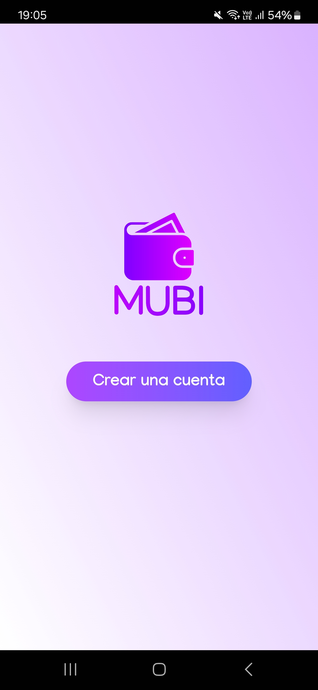
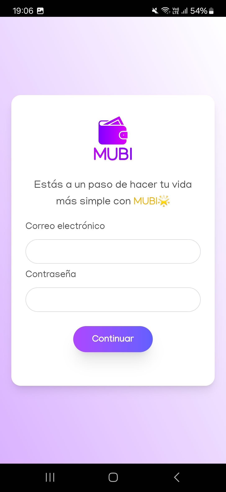
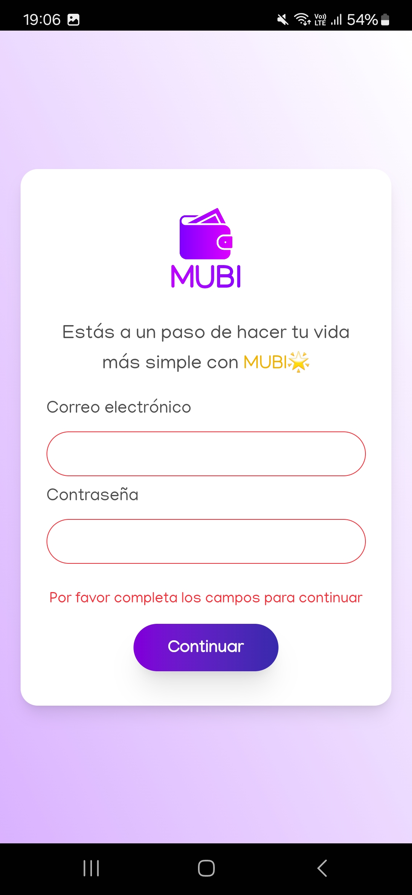
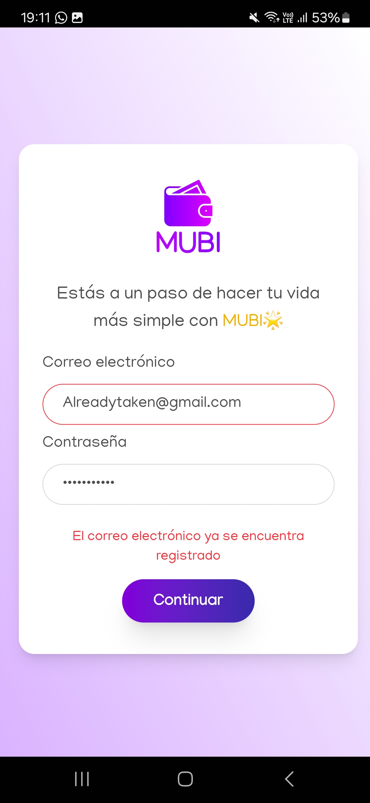
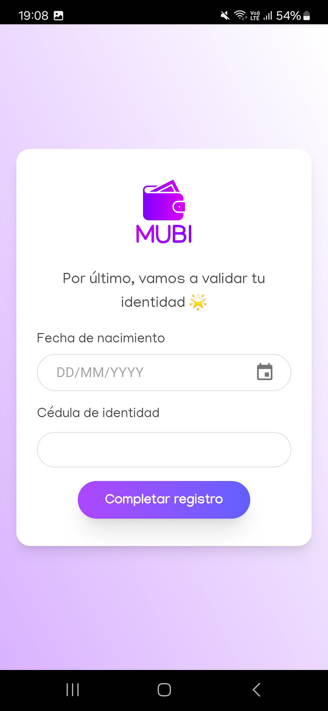
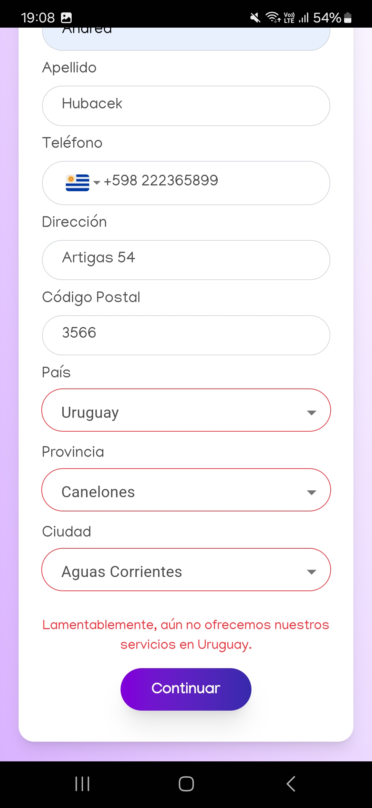
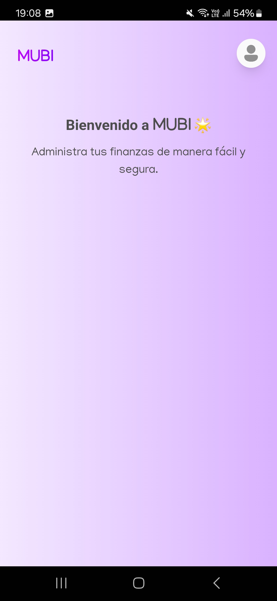
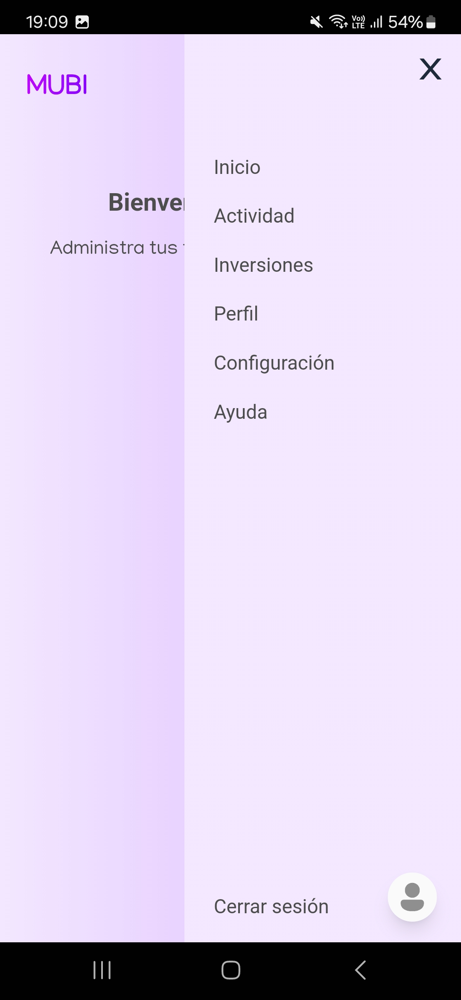
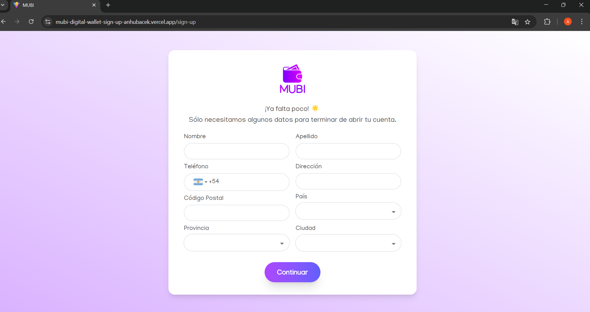
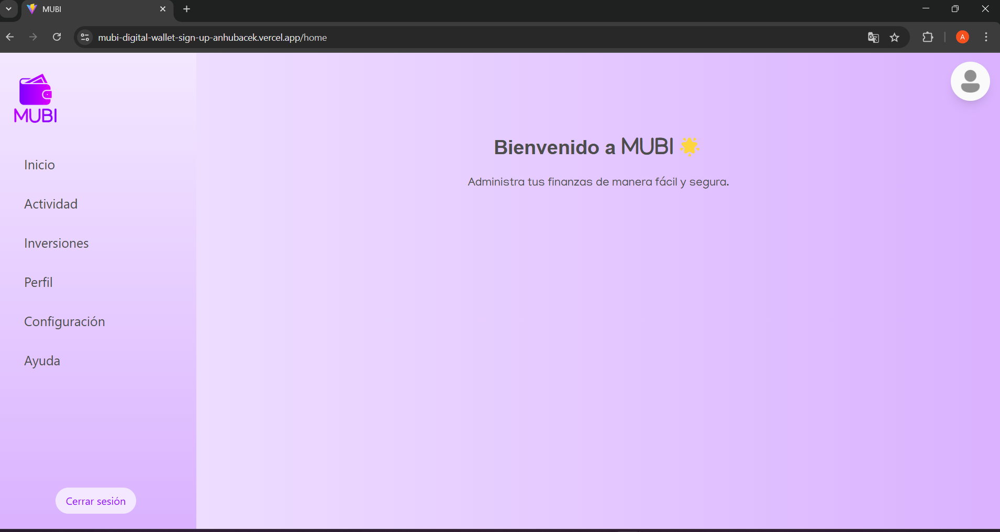
</div>


---

## 📝 How to Use

1. Clone the repository:
   ```bash
   git clone https://github.com/anhubacek/digital-wallet-sign-up.git
   ```
2. Navigate to the project directory:
   ```bash
   cd digital-wallet-sign-up
   ```
3. Install dependencies:
   ```bash
   npm install
   ```
4. Start the development server:
   ```bash
   npm run dev
   ```

---

## 📧 Contact

If you have any feedback or comments, feel free to reach out:

- **Email**: hubacekk@gmail.com
- **Linkedin**: https://www.linkedin.com/in/andreahubacek/

---
